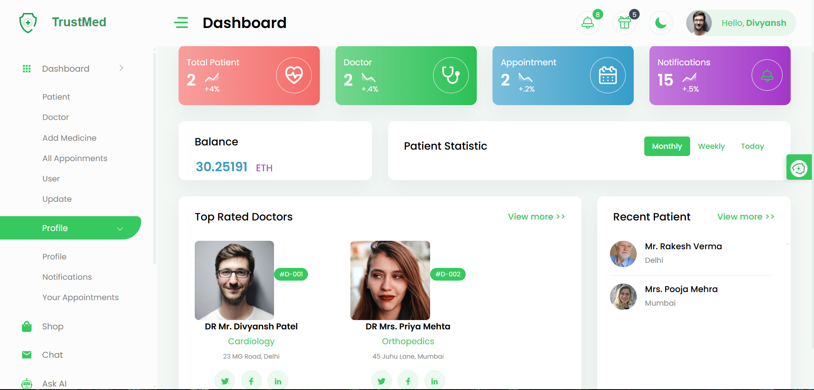

## TrustMed – Decentralized Healthcare Management System 🌐💊

TrustMed is a next-gen Web3 healthcare DApp that brings secure, transparent, and patient-friendly healthcare to the blockchain. Built on Ethereum and IPFS, it integrates doctors, patients, medicines, and AI assistance into a single decentralized platform.

#### 🔹 Key Features

* **Admin Dashboard** – Mentor the system, verify doctors, manage medicines & appointments.
* **Doctor Dashboard** – Track performance, manage consultations, prescribe digitally.
* **Doctor Profiles** – Explore specialties, work history, and patient ratings.
* **Secure Chat** – Real-time, blockchain-backed messaging between patients & doctors.
* **AI Health Assistant** – Quick guidance for minor health issues, escalates complex cases.
* **Decentralized Medicine Marketplace** – Buy authentic medicines securely with crypto payments.
* **Patient-Friendly Functionalities** – Update health records, book appointments, receive prescriptions digitally.

#### 🔹 Why TrustMed?

* **Blockchain Security** – Tamper-proof, trustless operations via smart contracts.
* **IPFS Storage** – Safe, decentralized storage for medical data & profiles.
* **Seamless Payments** – Use MetaMask for hassle-free crypto transactions.
* **Mobile-First** – Healthcare at your fingertips, anytime, anywhere.

TrustMed isn’t just a healthcare platform—it’s a Web3 healthcare revolution. 🚀


## Project Overview



Kindly follow the following Instructions to run the project in your system and install the necessary requirements

#### Install Vs Code Editor

```https://code.visualstudio.com/download
  GET: VsCode Editor
```

#### NodeJs & NPM Version

```https://nodejs.org/en/download
  NodeJs: v18.12.1
  NPM: 8.19.2
```

#### Pinata

```https://pinata.cloud
 GET PINATA API KEY
 GET PINATA SECRET KEY
```

All you need to follow the complete project and follow the instructions which are explained in the tutorial by Daulat

## Final Code Instruction

If you download the final source code then you can follow the following instructions to run the Dapp successfully


#### NodeJs & NPM Version

```
  NodeJs: v18.17.1 (MUST)
  VIDEO: https://youtu.be/PIR0oBVowXU?si=_jVYKmd94tPjmuQR
  NPM: 8.19.2
  URL: https://nodejs.org/en/download
```

#### RemixID

We are using RemixID for deploying the contract and generation of the ABI in the project, but you can use any other tools like Hardhat, etc.

```https://remix-project.org
  OPEN: RemixID
```

#### RPU URL PROVIDER

```
  NAME: ANKR.COM
  URL: https://www.ankr.com/rpc/
```

#### OPEN AI

```https://platform.openai.com/docs/api-reference/introduction
  # OPEN AI KEY
  URL: https://platform.openai.com/docs/api-reference/introduction
  NEXT_PUBLIC_OPEN_AI_KEY=YOUR_OPEN_AI_KEY
```

#### Pinata IPFS

```https://www.pinata.cloud/
  # PINATE KEYS
  URL: https://www.pinata.cloud/
  NEXT_PUBLIC_PINATA_AIP_KEY = YOUR_PINATA_API_KEY
  NEXT_PUBLIC_PINATA_SECRECT_KEY = YOUR_PINATA_SECRECT_KEY
```

## Authors

- [Divyansh089](https://github.com/Divyansh089)
