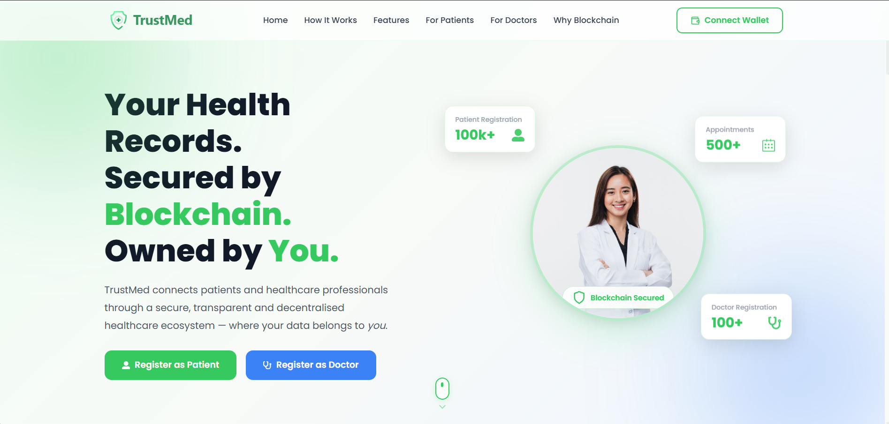
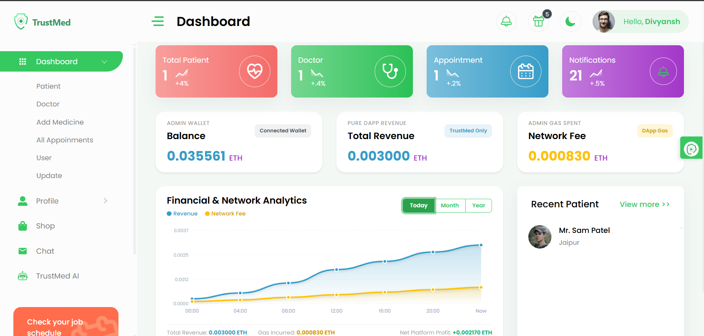

# TrustMed – Decentralized Healthcare Management System 🌐💊

[](https://nextjs.org/)
[](https://ethereum.org/)
[](https://soliditylang.org/)
[](https://pinata.cloud/)
[](https://ai.google.dev/)
[](https://metamask.io/)

---

## 📖 Overview — What is TrustMed?

**TrustMed** is a state-of-the-art Web3 Healthcare Decentralized Application (DApp) designed to transform traditional hospital management into an immutable, transparent, and patient-centric ecosystem. 

In traditional healthcare systems, patient records are frequently siloed across proprietary databases, vulnerable to data breaches, unauthorized tampering, and administrative opacity. Furthermore, pharmaceutical supply chains suffer from counterfeit products, and patient-doctor interactions often lack verifiable digital trails.

**TrustMed solves these challenges by combining:**
* **Blockchain Immutability:** Medical histories, doctor authorizations, consultations, and prescriptions are recorded directly on the Ethereum blockchain via smart contracts.
* **Decentralized Storage (IPFS):** High-volume patient records, medical certificates, and diagnostic files are stored securely in IPFS via Pinata, eliminating centralized single points of failure.
* **Generative Health AI:** Integration of Google's Gemini AI engine provides patients with 24/7 intelligent symptom triage, healthcare guidance, and first-aid recommendations.
* **Direct Patient Empowerment:** Patients maintain full ownership of their health identity and medical data, accessing services seamlessly through their Web3 wallet without third-party intermediaries.

---

## 🛠️ Tech Stack

TrustMed utilizes a robust and modern Web3 technology stack spanning frontend development, smart contract engineering, decentralized file storage, and artificial intelligence:

| Category | Technology | Description |
| :--- | :--- | :--- |
| **Frontend Framework** | **Next.js 13 & React 18** | Fast, server-rendered and statically exported client interface with responsive layouts. |
| **Styling & UI** | **Vanilla CSS, SCSS, Bootstrap** | Curated custom styling with dynamic themes, smooth glassmorphism, and responsive design. |
| **Icons & Visuals** | **React Icons (Fa, Bs, Sl, Io, Ti)** | Clean, modern iconography throughout navigation, actions, and status badges. |
| **Data Visualization** | **ApexCharts & Chart.js** | Interactive financial charts, revenue vs. network fee analytics, and patient metrics. |
| **Smart Contracts** | **Solidity (^0.8.0)** | EVM-compatible smart contracts governing doctors, appointments, prescriptions, and marketplace orders. |
| **Blockchain Development**| **Hardhat & Ethers.js (v5)** | Local node orchestration, contract testing, deployment scripts, and Web3 RPC interaction. |
| **Decentralized Storage**| **IPFS / Pinata Gateway** | Distributed peer-to-peer storage for medical documentation, avatar images, and prescription metadata. |
| **Artificial Intelligence** | **Google Gemini AI (1.5 Flash)** | Advanced LLM integration for intelligent health assistance, symptom triage, and medical chat support. |
| **Web3 Authentication** | **Web3Modal & MetaMask** | Seamless browser wallet connection, account switching, and transaction signing. |

---

## ✨ Features & What We Provide

TrustMed delivers an all-inclusive suite of healthcare modules designed for hospital administrators, certified doctors, and patients:

### 1. 🛡️ Hospital Admin Control Center
* **Comprehensive Metrics:** Live platform statistics displaying total registered doctors, verified patients, completed appointments, and platform transactions.
* **Financial Analytics:** Dynamic multi-interval charts (**Today, Month, Year**) displaying real-time platform revenue and network gas fees.
* **Doctor Approval & Management:** Review doctor applications, verify medical licenses, and grant verified credentials on-chain.
* **Medicine Catalog Control:** Administer the decentralized medicine catalog with real-time stock and pricing adjustments.

### 2. 👨‍⚕️ Doctor Consultation Workspace
* **Verified Doctor Identity:** On-chain doctor profile highlighting specialty, hospital affiliation, experience, and consultation charges.
* **Appointment Queue:** Manage scheduled appointments, track consultation status, and view patient appointment history.
* **Digital Prescriptions:** Generate verifiable prescriptions linked to patient records directly through smart contracts.

### 3. 👤 Decentralized Patient Portal
* **Wallet-Native Identity:** Zero password-based logins; authenticate securely via Ethereum wallet address (MetaMask).
* **Appointment Booking:** Search for specialized doctors, schedule appointments, and pay consultation fees in ETH with automated transaction verification.
* **Medical Profile & History:** View past prescriptions, diagnoses, and consultation receipts stored securely on IPFS.

### 4. 💬 On-Chain Secure Patient-Doctor Chat
* **Authenticated Messaging:** Real-time communication between registered patients and assigned healthcare providers.
* **Visual Active State:** Quick contact selection with responsive status badges and persistent chat logs.
* **Consultation Follow-Up:** Discuss ongoing symptoms, medication adjustments, and post-appointment inquiries.

### 5. 🤖 TrustMed AI Health Assistant
* **Instant Symptom Triage:** Powered by Google Gemini 1.5 Flash, providing preliminary guidance for non-emergency health concerns.
* **Personalized Health Insights:** Inquire about medication details, dietary wellness, and first-aid recommendations.
* **Medical Escalation:** Intelligently advises consultation booking with specialized doctors when red-flag symptoms are detected.

### 6. 💊 Decentralized Medicine Marketplace
* **Authentic Pharmaceutical Catalog:** Browse verified medications, active ingredients, batch details, and pricing.
* **Crypto Payments:** Complete medicine purchases using crypto transactions with automated smart contract escrow.
* **Transparent Pricing:** Direct peer-to-pharmacy transactions without intermediary markups.

---

## 🖼️ Project Demo & Screenshots

### 1. Overview
A preview of the TrustMed landing page.


### 2. Admin Dashboard
Real-time metrics, appointment volume, and interactive revenue vs. network fee breakdown.


---

## 🚀 Getting Started

Follow these instructions to set up and run the TrustMed DApp locally on your system:

### 1. Prerequisites
* **Node.js:** `v18.17.1` or higher
* **NPM:** `v8.x` or higher
* **MetaMask Extension:** Installed in your browser ([Download MetaMask](https://metamask.io/download/))

### 2. Installation
Clone the repository and install the project dependencies:
```bash
git clone https://github.com/Divyansh089/TrustMed.git
cd TrustMed
npm install
```

### 3. Environment Configuration
Create a `.env.local` file in the root directory and configure the required environment variables:
```env
# Smart Contract & Network Configuration
NEXT_PUBLIC_HEALTH_CARE=0xYourDeployedContractAddress
NEXT_PUBLIC_ADMIN_ADDRESS=0xYourAdminWalletAddress
NEXT_PUBLIC_NETWORK=holesky

# Google Gemini AI API Key
NEXT_PUBLIC_GEMINI_API_KEY=your_gemini_api_key_here

# Pinata IPFS Gateway Credentials
NEXT_PUBLIC_PINATA_AIP_KEY=your_pinata_api_key_here
NEXT_PUBLIC_PINATA_SECRECT_KEY=your_pinata_secret_key_here
```

### 4. Run Development Server
Start the local development server:
```bash
npm run dev
```
Open [http://localhost:3000](http://localhost:3000) (or `http://localhost:3001` if port 3000 is occupied) in your browser to interact with the DApp.

### 5. Production Build & Static Export
To compile an optimized production build:
```bash
npm run build
```

---

## 👨‍💻 Author

* **Divyansh Patel** — [@Divyansh089](https://github.com/Divyansh089)

---

*TrustMed — Bringing trust, security, and intelligence to decentralized healthcare.* 🌿
